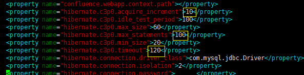

# 搭建

1. 构建镜像：`docker build -f Dockerfile -t confluence/confluence:7.4.14 .`
2. 调整`docker-compose.yml`中的`JVM_MAXIMUM_MEMORY`
3. 启动镜像：`docker-compose up -d`

## 激活

1. 进入confluence页面
2. 复制server id
3. 进入confluence容器：`docker exec -it confluence /bin/bash`
4. 生成激活码：`java -jar /opt/atlassian/confluence/atlassian-agent.jar -p conf -m example@example.com -n example -o https://www.example.com -s AAAA-BBBB-CCCC-DDDD`

## 配置

1. 选择`my own database`
2. databasetype：mysqlhostname`mysql` port:3066 database name:confluence username:root pass:root

## 优化

vi ./data/confluence/data/confluence.cfg.xml

## 插件激活

和前面生成激活码差不多：`java -jar atlassian-agent.jar -p "应用密钥" -m example@example.com -n example -o https://www.example.com -s AAAA-BBBB-CCCC-DDDD`

## 接入OIDC登录认证

使用admin账号，进入管理应用界面，上传confluence-oauth-1.1.27.jar
插件配置默认走https协议，如果需要修改为http，可以下载配置文件，手动修改之后，再上传覆盖